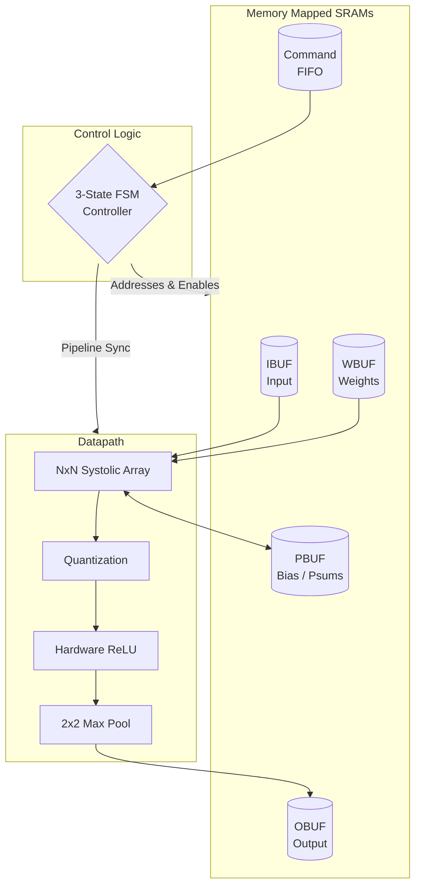

<h1 align="center">Configurable Neural Processing Unit (NPU)</h1>

<p align="center">
  
  
  
  
  
  
  
</p>

---

## A-Z Architectural Specification

The Neural Processing Unit is a deeply optimized, parameterized hardware accelerator designed to natively execute Convolutional Neural Networks (CNNs) and Dense Matrix operations. It abstracts raw systolic array timing behind a zero-protocol SRAM interface and an autonomous hardware controller.

### 1. Weight-Stationary Systolic Array
At the core of the NPU lies an `NxN` Systolic Array operating on a highly efficient **Weight-Stationary** dataflow:
* **Pre-loading:** Weights are streamed vertically into the Processing Elements (PEs) and latched into localized registers. 
* **Execution:** Input activations flow horizontally across the array, while 32-bit partial sums (Psums) cascade vertically downward.
* **Precision:** The matrix engine computes `8-bit x 8-bit -> 32-bit` MAC operations in a deeply pipelined grid, minimizing SRAM bandwidth and maximizing throughput.

### 2. The 3-State FSM Controller
The entire execution pipeline is governed by a strict 3-State Finite State Machine (`layer_controller.v`), eliminating the need for CPU intervention during compute:
* **STATE 1 (IDLE):** The NPU clock-gates idle logic and polls the asynchronous Command FIFO. The external CPU or DMA has full read/write access to fill the IBUF, WBUF, and PBUF.
* **STATE 2 (LOAD_WEIGHT):** The controller locks external memory access, generates sequential addresses for the WBUF, and streams the `N` rows of weights into the systolic grid to lock them in place.
* **STATE 3 (RUN_MAC):** The controller streams activations from the IBUF, manages the latency of the physical Skew Buffers (delaying inputs by row/column index to ensure systolic diagonal alignment), drives partial sum accumulation, and pushes the final results into the post-processing pipeline.

### 3. Integrated Memory Hierarchy
The architecture utilizes tightly-coupled, localized SRAMs to prevent SoC bus starvation:
* **IBUF (Activation Buffer):** Stores flattened `im2col` activation patches or standard input vectors.
* **WBUF (Kernel Buffer):** Stores the static neural network weights.
* **PBUF (Partial Sum / Bias Buffer):** A dual-purpose 32-bit wide SRAM. It stores intermediate tensors for multi-pass large matrix tiling, or it can be pre-loaded by the CPU with Bias vectors (`+ C`) which the NPU automatically accumulates during execution.
* **OBUF (Output Buffer):** A read-only SRAM storing the final scaled, activated tensors.

### 4. Hardware Post-Processing Pipeline
The unskewed 32-bit outputs exiting the systolic array instantly enter a hardware post-processing chain before reaching the OBUF:
* **Quantization Shift:** A barrel shifter dynamically scales the 32-bit accumulation down to an 8-bit precision limit, matching int8 Post-Training Quantization (PTQ) standards.
* **Hardware ReLU:** A digital comparator instantly clamps any negative integers to `0`.
* **2x2 Max Pooling:** A dedicated hardware block captures successive `2x2` output windows. It routes only the maximum value to the OBUF, effectively halving the spatial resolution in real-time without software overhead.

---

## System Operation (How It Works)

To perform a complete inference pass, the integrating system must execute the following hardware sequence:

1. **Memory Initialization:** The host processor or DMA writes input activations directly into `IBUF`, neural network weights into `WBUF`, and optional bias offsets into `PBUF`.
2. **Weight Load Command:** The host writes `0x10000000` (`OP_LOAD_WEIGHTS`) to the asynchronous Command FIFO. The FSM transitions to `STATE 2`, iterating through SRAM addresses to fill the systolic grid vertically.
3. **Execution Command:** The host writes `0x200000XX` (`OP_RUN_MAC`) to the Command FIFO, where `XX` is the cycle parameter.
4. **Hardware Execution:** The FSM transitions to `STATE 3`. Activations are read from `IBUF`, skewed via shift registers, and pushed horizontally across the array. The accumulated dot products exit the array vertically, pass through the quantization and activation logic, and are latched into `OBUF`.
5. **Interrupt Generation:** Upon completing the specified cycle count and draining the pipeline, the NPU raises a hardware interrupt line to signal the host processor that `OBUF` contains valid data.

---

## Architectural Block Diagram

The datapath completely isolates memory routing from the computational core, ensuring zero-stall execution during processing phases.



---

## Verification Usage (How to Test)

The repository provides an automated, Python-based verification suite built on Cocotb. It verifies cycle-accurate hardware execution against floating-point Numpy golden models.

### Prerequisites
* Python 3.8+
* `cocotb`, `numpy`
* Verilator (Cycle-accurate Verilog simulator)

### Execution
Navigate to the testbench directory and invoke the automated regression suite:
```bash
cd tb
make
```

### Test Coverage
The suite executes the following mandatory coverage assertions:
1. **Identity Matrices:** Verifies baseline matrix-vector alignment and systolic flow.
2. **Zero Matrices:** Verifies truncation states and reset conditions.
3. **Randomized Data:** Verifies dynamic integer dot-product functionality.
4. **Checkerboard Patterns:** Verifies alternating bit-flip stability.
5. **Maximum Values:** Verifies accumulator overflow resistance and saturation limits.
6. **Hardware ReLU:** Asserts strict integer clamping against negative thresholds.
7. **Quantization Precision:** Asserts dynamic bit-shifting mathematics.
8. **Max Pooling Isolation:** Asserts spatial `2x2` comparison logic.
