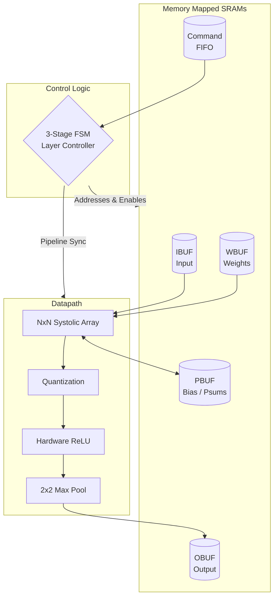

<h1 align="center">Configurable Neural Processing Unit (NPU)</h1>

<p align="center">
  
  
  
  
  
  
</p>

---

## Architectural Block Diagram

The datapath completely isolates memory routing from the computational core, ensuring zero-stall execution during processing phases.



## RTL Structural Design

The repository follows strict, production-grade structural Verilog constraints to guarantee timing closure and maintainability.

### 1. The 3-Stage (3-Block) FSM
The `layer_controller.v` is explicitly engineered using the industry-standard **3-Stage FSM architecture**. This prevents combinational glitches and isolates state tracking from output logic.

```verilog
// STAGE 1: Sequential State Update
always @(posedge clk or negedge rst_n) begin
    if (!rst_n) state <= S_IDLE;
    else state <= next_state;
end

// STAGE 2: Combinational Next-State Logic
always @(*) begin
    next_state = state; // Default hold
    case (state)
        S_IDLE: if (cmd_valid) next_state = S_LOAD;
        S_LOAD: if (load_done) next_state = S_IDLE;
        // ... state routing logic
    endcase
end

// STAGE 3: Registered Output Logic
always @(posedge clk or negedge rst_n) begin
    // Drives SRAM read addresses and array enables synchronously
end
```

### 2. Module Hierarchy
The logic is cleanly modularized. `npu_top.v` orchestrates the entire flow without legacy wrappers:
* `npu_top.v`
  * `layer_controller.v` (3-Stage FSM)
  * `sram_buffers.v` (IBUF, WBUF, OBUF)
  * `accumulator_pbuf.v` (Bias Addition)
  * `systolic_array.v` (NxN MAC Engine)
    * `pe.v` (Processing Elements)
  * `activation_pool.v` (ReLU & Pooling)

## Core Features

* **Parameterized Scale:** Scale the physical matrix size simply by overriding `parameter N`. No internal logic changes required.
* **Native Bias (A*B + C):** CPU pre-loads bias vectors into the PBUF. The hardware automatically fetches and accumulates them during execution.
* **Zero-Protocol Interface:** Abstracted `addr`, `data`, `we` ports bypass the heavy latency of internal AXI/Avalon wrappers, allowing seamless SoC integration.

## Verification

Verified via Python/Cocotb against Numpy Golden Models asserting 100% bit-accuracy on extreme edge cases: 
* Identity Matrices & Zeros
* Accumulator Saturation (Maximum Values)
* ReLU integer clipping
* 2x2 Spatial Pool Isolation
